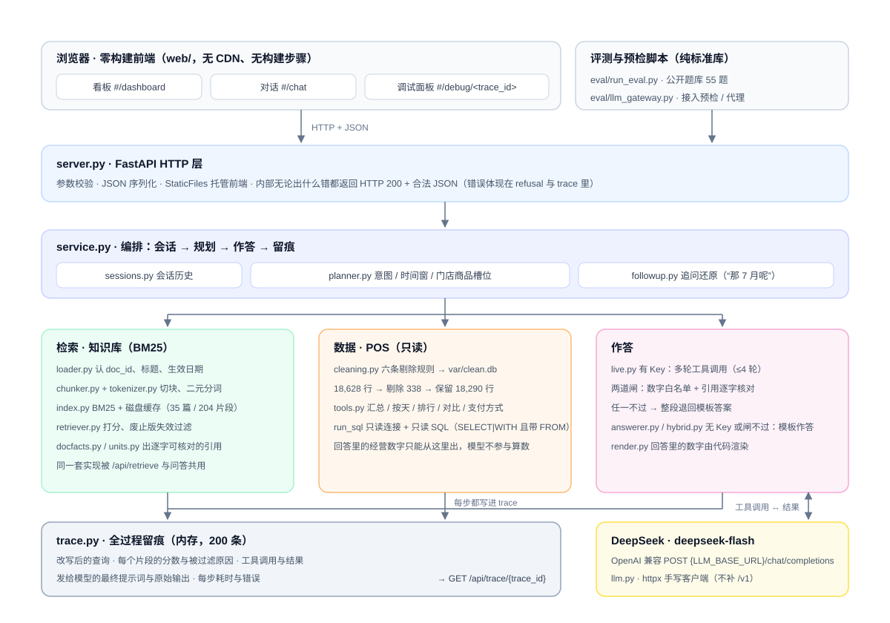

# Moneki.ai 实操作业 · 提交说明

一家 5 门店连锁餐饮的经营看板 + 混合问答服务：一条线查 POS 数据库，一条线查公司知识库。
前同事留下的 RAG 服务（`starter/`）能跑但经常答错，我把它修好、按契约补齐接口，并加了一个能调试它的面板。

| | |
|---|---|
| 公开题库 | **100.00 / 100**（55/55 题，真实 DeepSeek）；starter 初始 **18.00** |
| 测试 | **173 条**全绿，`make test` 实测 1.4 秒 |
| 重建 | `make rebuild` **0.2 秒**（含进程启动；其中建索引 0.1 秒），无网络、无下载、不需要 Key |
| 依赖 | 4 个：`fastapi` / `uvicorn` / `httpx` / `pytest` |
| 交付 | 本文件 · `DEBUG_LOG.md` · `EVAL_REPORT.md` · `LLM_SETUP.md` · `AI_USAGE.md` · `DEMO.md` |

## 1. 跑起来

需要 Python 3.12。**三条命令**：

```bash
cd starter
make setup      # 建 .venv 并装 4 个依赖（用 uv）
make rebuild    # 从 ../data 与 ../knowledge_base 重建清洗表与检索索引
make run        # 服务起在 http://127.0.0.1:8000
```

没装 `uv` 的，把 `make setup` 换成：

```bash
python3.12 -m venv .venv && .venv/bin/pip install -r requirements.txt
```

打开 <http://127.0.0.1:8000>，三个视图：`#/dashboard` 看板、`#/chat` 对话、`#/debug/<trace_id>` 调试面板。
**不配置任何 Key 也能跑完全程**：`/api/health` 报 `llm_mode: "mock"`，看板、检索、调试面板照常，
问答走不依赖模型的模板作答（数字与引用仍由代码渲染）。

### 重建命令（换 `data/` 与 `knowledge_base/` 之后跑这一条）

```bash
make rebuild                                        # 默认读 ../data 与 ../knowledge_base
make rebuild DATA_DIR=/path/data KB_DIR=/path/kb    # 换一套数据与知识库
```

它做两件事，全部从这两个目录现算，代码里不写死任何数字、答案或文档内容：

- 清洗 `data/pos.db` → `starter/var/clean.db`：按 KB-001 §2 规范化、§3 六条规则依次剔除；
- 建 BM25 索引 → `starter/.cache/index.json`：本次是 35 篇文档 / 204 个片段。
  缓存键由知识库内容算出，文档一增一改，缓存自动作废重建。

> 现场往知识库加文档：跑一次 `make rebuild`，再重启服务（索引在启动时载入内存）。
> 两步合计 1 秒出头。这是本实现已知的限制，见第 5 节。

### 其余命令

```bash
make test        # 173 条测试
make eval-free   # 检索 / 指标 / 健康检查三类，22 分，不调模型，免费，随时可跑
make eval-mock   # 完整 55 题，自己起一个没配 Key 的服务来跑，免费
make eval        # 完整 55 题，对着 live 服务跑，要 Key、要花钱
make eval-mine   # 我自己补的 8 道题（先离线体检再跑）
```

四个 eval 目标跑完都会跟回归基线（`eval/reports/2026-09-26_confirm_100`）比一次，
**掉分则退出码非零**——「没伤到以前的分数」是条能跑的命令，不是一句感觉。

换成评审自己的模型：不改代码，只改三个环境变量，见 `LLM_SETUP.md` 第 3 节。

## 2. 架构图



（可编辑的源文件：`docs/architecture.svg`）

**一次提问的走向**（`POST /api/chat`）：

1. `server.py` 收下 `session_id` 与 `question`，宽类型转成字符串后交给 `service.py`；
2. 取出该 session 的历史，连同问句一起给 `planner.py`。**历史必须在这一步参与**，
   否则「那 7 月呢」会在规划阶段被当成孤立追问反问回去。产出 `intent`
   （data / doc / hybrid / refusal / clarify）与时间窗、门店、商品等槽位；
3. `_run_engine()` 二选一：配了 Key 走 `live.py`（把 10 个工具交给模型反复问，最多 4 轮），
   否则走模板 `answerer.py`；
4. `LiveEngine._finalise()` 是这道题的**质量闸**：从模型正文里抽出 `[KB-xxx]` → 用检索到的
   原文生成**逐字可核对**的引用 → 校验正文里每个数字都能在「模型确实看过的内容」里找到，
   找不到就整段退回模板答案 → 最后按答案实际用到的数裁剪证据；
5. 这一轮记进会话，返回 `answer` / `answer_type` / `citations` / `data_evidence` / `trace_id`。
   每一步的耗时、检索明细、工具调用、最终提示词与模型原始输出都写进 `trace.py`，
   `GET /api/trace/{trace_id}` 取回，前端 `#/debug/<trace_id>` 把它可视化。

## 3. 选型理由

- **检索用 BM25，不用向量模型。** 契约 §7.6 里向量是可选。知识库只有 35 篇 204 个片段，
  BM25 是纯标准库实现：零下载、零依赖、服务冷启动到 `/api/health` 就绪 0.24 秒、
  `make rebuild` 0.2 秒。
  评审要反复重建索引，这个成本差异很大。代价是跨语言弱（英文文档靠词形），
  已写进 `LLM_SETUP.md` 第 8 节。
- **数字与引用由代码渲染，模型只负责叙述。** 契约 §7.3 说得很直白：「不要指望靠
  `temperature=0` 得到确定性，回答里的数字必须由你的代码从工具结果渲染」。
  所以模型写的正文要过两道闸（数字白名单、引用逐字核对），任一不过就退回模板答案。
  宁可答得朴素，不可答得像真的但数字是编的。
- **思考模式保持 DeepSeek 默认（开启）。** 契约 §7.3 要求写明的一项。这是多轮工具调用式
  问答，模型要自己规划「先查什么、再查什么、够不够回答」，思考模式对这一步行帮助明显；
  关掉更快更省，但规划更容易乱。代价是慢一些、token 贵一些。对应的两个处理
  （`max_tokens=4096`、多轮之间原样回传 `reasoning_content`）写在 `LLM_SETUP.md` 第 1 节。
- **手写 httpx 客户端，不用厂商 SDK。** 契约 §7.3 的一长串规则（地址原样拼接不补 `/v1`、
  不许出现文档外的参数、assistant 消息整条回传、`finish_reason` 五种错误码、错误码不得
  让接口 500）全是关于「发出去的请求长什么样」。自己拼请求，这些就都是看得见的几行代码，
  也不用为此多一个依赖。整个项目只有 4 个依赖。
- **前端零构建，不实现流式。** `web/` 三个文件由 `StaticFiles` 直接托管，没有 CDN、没有构建
  步骤、没有新依赖，离线可用。`/api/chat` 一次返回完整结果，理由是不必为了首字延迟引入
  SSE 解析、断流重连这一整套复杂度——代价是长回答的等待感更明显，界面用「思考中」状态补。

## 4. 口径与歧义的取舍

### 指标口径（以知识库 KB-001 为准，三处实现同源，不各算各的）

| 指标 | 口径 | 常见的错法 |
|---|---|---|
| 净营业额 | **销售行 + 退款行**（退款是负数，实际是相减） | 排除退款行 → 营业额被算高 |
| 退款金额 | 退款行金额之和的**绝对值** | 直接给负数 |
| 有效订单数 | **销售行**里不同 `order_id` 的个数，多行订单算 1 单、退款行不单独计单 | 用明细行数 → 一单两个菜算两单 |
| 客单价 | 净营业额 ÷ 有效订单数，四舍五入 2 位 | 分母跟着上一条一起错 |
| 销量 | 销售行 `qty` 之和 − 退款行 `qty` 之和 | 只看销售行 |
| 日期区间 | **闭区间**，含最后一天；筛选时退款行按**退款行自己的日期**归属，不回溯原单 | 半开区间 → 丢掉最后一天 |

### 数据清洗（KB-001 §2 规范化 + §3 六条剔除，按顺序）

原始 18,628 行 → 剔除 338 行 → 保留 **18,290 行**（销售 18,196 + 退款 94）：
日期不可解析 8、金额为空 150、数量 ≤ 0 30、门店外键不在 `stores` 10、商品外键不在 `products` 40、
完全重复行 100。

两处容易做反的细节：`store_id` / `product_id` 先**去空白转大写**再判断合法性（`s01`、`S01 ` 是合法编号，
不是脏数据）；日期有 `DD-MM-YYYY` 这种**日在前**的旧格式（`25-07-2026` 是 7 月 25 日），
解析方向搞反了看不出来，所以拿「日大于 12」的样本专门测过。

### 任务书没写死、我自己拍板的几处

1. **废止文档不参与打分。** 文档带 `status` 与 `superseded_by`，继任版一旦生效，旧版就不再
   参与打分；只有用户明确问「以前 / 原来」时才给旧版。这是本次最关键的一处修复
   （见 `DEBUG_LOG.md` 缺陷 22）：修复前废止版常常压过现行版排第一。
2. **估算类文档不当答案。** 周报、会议纪要、活动复盘里的数字是人工估算，KB-001 §5
   明确说只能当背景参考。所以数字问题不引用它们，也不拿它们渲染答案。
3. **数据库与文档冲突时，以数据库为准**（KB-001 §5 第 1 条）；反过来，
   `products.unit_price` 是建档价、可能滞后于实际售价，**不能**当某一天的成交价，
   售价问题以调价通知为准（§5 第 3 条）。
4. **正文里认出来的门店只当线索，不当硬过滤条件。** KB-001 正文自己就拿 `s01` 举过例子，
   把它当过滤条件会误伤。
5. **`quote` 一律从检索到的原文里现取**，不让模型自己写。契约 §5 说会逐字核对，
   那就由代码保证它逐字存在，而不是指望模型抄对。
6. **未知就说不确定**，不给编造的原因和数字：数据里没有、文档里也没有的，如实说不知道
   （`answer_type: "refusal"`），这也是模板作答兜底存在的原因。

## 5. 得分与复现

| 阶段 | 得分 | 报告 |
|---|---|---|
| starter 初始状态 | **18.00 / 100**（12/55 题） | `eval/reports/2026-09-26_baseline_live.json` |
| 最终版本（真实 DeepSeek，两次独立运行） | **100.00 / 100**（55/55 题） | `eval/reports/2026-09-26_after_version_evidence/`、`eval/reports/2026-09-26_confirm_100/` |

每一轮的原始报告都归档在 `eval/reports/` 下，运行命令、commit、模型与关键配置见 `EVAL_REPORT.md`；
从 18 分到 100 分的排查过程按缺陷逐条记在 `DEBUG_LOG.md`；接入预检 14 项的输出贴在 `LLM_SETUP.md` 第 7 节。

### 已知限制

- **加文档后要重启服务**：索引在启动时载入内存，`make rebuild` 只重写磁盘上的索引文件。
  两步合计 1 秒出头，但确实是「要重启」，不是热加载。
- **检索不支持跨语言**：中文二元分词 + BM25，英文文档靠词形匹配，跨语言同义改写查不到。
- **trace 存在内存里**：容量 200 条，重启即失，不落盘。


